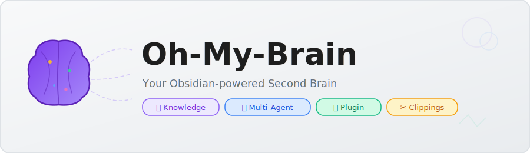
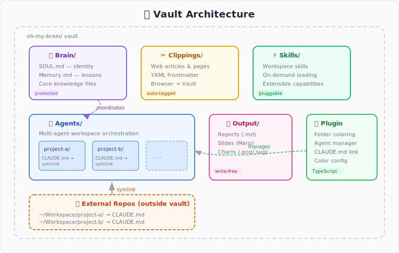
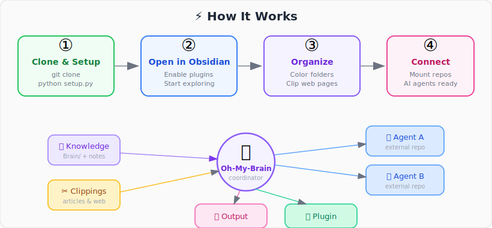

<p align="center">
  
</p>

<p align="center">
  <strong>Your Obsidian-powered second brain — knowledge management, web clippings, and multi-agent orchestration in one vault.</strong>
</p>

<p align="center">
  <a href="LICENSE"></a>
  
  
  
  
</p>

<p align="center">
  <a href="README_zh-CN.md">🇨🇳 中文文档</a> · <a href="#-quick-start">Quick Start</a> · <a href="#-features">Features</a> · <a href="#-architecture">Architecture</a>
</p>

---

## 🤔 What is Oh-My-Brain?

Oh-My-Brain is an opinionated **Obsidian vault template** for power users who want a single hub for:

- 📚 **Personal knowledge** — notes, memories, and structured thinking
- ✂️ **Web clippings** — articles and pages collected from browsers
- 🤖 **Multi-agent orchestration** — mount external code repos and coordinate AI agents from one place
- 🎨 **Visual organization** — color-coded folders with a shared config that travels with your vault

It ships with a custom Obsidian plugin (**Oh My Brain**) and a one-click setup script — clone, run, and you're ready.

<br/>

## ✨ Features

### 🔌 Oh My Brain Plugin

<table>
  <tr>
    <td width="50%">

**🎨 Folder Coloring**

Right-click any folder → pick from 27 presets or a custom color picker. Colors cascade to child folders. Config is git-tracked so every clone looks the same.

</td>
    <td width="50%">

**🤖 External Agent Management**

Mount any local code repository as a vault subdirectory. The repo's `CLAUDE.md` is symlinked automatically — your AI agent context lives alongside your notes.

</td>
  </tr>
  <tr>
    <td>

**🔗 CLAUDE.md Linking & Sync**

Symlinks preferred; auto-falls back to copy when symlinks aren't available. One-click re-sync from command palette or right-click menu.

</td>
    <td>

**⚙️ Two-Layer Color Config**

Shared colors in `folder-colors.json` (git-tracked) + personal overrides in `data.json` (gitignored). Just like VS Code's settings model.

</td>
  </tr>
</table>

<br/>

## 🏗️ Architecture

<p align="center">
  
</p>

<details>
<summary>📂 Directory tree</summary>

```
oh-my-brain/
├── Brain/                  # Core knowledge: SOUL.md, Memory.md
│   ├── SOUL.md             # Agent identity & behavioral constraints
│   └── Memory.md           # Persistent runtime memory & decisions
├── Clippings/              # Web clippings from browsers
├── Skills/                 # Workspace skill definitions
├── Agents/                 # External agent workspaces
│   └── <alias>/
│       └── CLAUDE.md       # → Symlink to external repo's CLAUDE.md
├── Output/                 # Generated reports, slides, images
├── oh-my-brain-plugin/     # Plugin source & setup script
│   ├── src/                # TypeScript source code
│   ├── folder-colors.json  # Shared color config (git-tracked)
│   └── setup.py            # One-click initialization
├── .obsidian/              # Obsidian internal config
└── CLAUDE.md               # Project guide for AI agents
```

</details>

<br/>

## ⚡ How It Works

<p align="center">
  
</p>

Oh-My-Brain acts as a **central coordinator**. Your knowledge, clippings, and external agent workspaces are all visible in one vault. The custom plugin handles folder coloring and repo mounting. AI agents read CLAUDE.md files to understand each workspace's context.

<br/>

## 🚀 Quick Start

### Prerequisites

| Tool | Version | Purpose |
|------|---------|---------|
| [Obsidian](https://obsidian.md/) | v1.4.5+ | The vault host |
| [Node.js](https://nodejs.org/) | v18+ | Build the plugin |
| [Python 3](https://www.python.org/) | v3.10+ | Run the setup script |
| Git | any | Clone the repo |

### Installation

```bash
# 1. Clone the vault
git clone https://github.com/<your-username>/oh-my-brain.git
cd oh-my-brain

# 2. One-click setup — builds plugin, downloads dependencies
python oh-my-brain-plugin/setup.py

# 3. Open in Obsidian
#    Obsidian → Open folder as vault → select oh-my-brain/
#    Settings → Community plugins → Disable Restricted mode → Enable plugins
```

<details>
<summary>⚙️ Setup options</summary>

```bash
python oh-my-brain-plugin/setup.py --force          # Force rebuild / reinstall
python oh-my-brain-plugin/setup.py --skip-build     # Skip building local plugins
python oh-my-brain-plugin/setup.py --skip-download   # Offline mode, skip remote downloads
```

</details>

### Bundled Plugins

#### Required (auto-installed)

| Plugin | Source | Description |
|--------|--------|-------------|
| **Oh My Brain** | Local (`oh-my-brain-plugin/`) | Core plugin: folder coloring, agent management, CLAUDE.md linking |
| **Execute Code** | [twibiral/obsidian-execute-code](https://github.com/twibiral/obsidian-execute-code) | Run code blocks directly in notes (Python, JS, Shell, 20+ languages) |

#### Optional (interactive selection during setup)

| Plugin | Source | Description |
|--------|--------|-------------|
| **Claudian** | [YishenTu/claudian](https://github.com/YishenTu/claudian) | Claude AI chat inside Obsidian (requires API key) |
| **Marp Slides** | [samuele-cozzi/obsidian-marp-slides](https://github.com/samuele-cozzi/obsidian-marp-slides) | Markdown → presentation slides |
| **Excalidraw** | [zsviczian/obsidian-excalidraw-plugin](https://github.com/zsviczian/obsidian-excalidraw-plugin) | Whiteboard diagrams, sketches, and mind maps |

<br/>

## 📖 Usage

### 🎨 Folder Coloring

1. Right-click any folder in the file explorer
2. Click **Set folder color** → pick a color
3. Toggle **Apply to children** to cascade

> **Shared vs. Personal**: Colors saved to `oh-my-brain-plugin/folder-colors.json` are shared via git. Personal overrides in plugin `data.json` are gitignored.

### 🤖 Adding an External Agent

1. `Ctrl+P` → **Add External Agent**
2. Browse to a local repo
3. Set an alias and color
4. The plugin creates `Agents/<alias>/` with a symlinked `CLAUDE.md`

### 🔄 Syncing CLAUDE.md

- **Single agent**: Right-click agent folder → **Sync CLAUDE.md**
- **All agents**: Command palette → **Sync all agent CLAUDE.md files**

<br/>

## 🎨 Color Config System

The plugin uses a two-layer config model — think VS Code settings:

```
┌─────────────────────────────────────────────────────┐
│  User Layer (data.json)           ← gitignored      │
│  Overrides per-path                                  │
├─────────────────────────────────────────────────────┤
│  Shared Layer (folder-colors.json) ← git-tracked    │
│  Defaults for all users                              │
└─────────────────────────────────────────────────────┘
         ▲ User wins when both define the same path
```

Toggle **"Use shared colors"** in plugin settings to disable the shared layer entirely.

<br/>

## 🛠️ Development

```bash
cd oh-my-brain-plugin
npm install
npm run build          # Production build
# Output → .obsidian/plugins/oh-my-brain/
```

The plugin is built with **TypeScript + esbuild**. Source lives in `oh-my-brain-plugin/src/`.

<br/>

## 🗂️ Key Files

| File | Purpose |
|------|---------|
| `CLAUDE.md` | Project guide — AI agent reads this for vault context |
| `Brain/SOUL.md` | Agent identity and behavioral constraints |
| `Brain/Memory.md` | Persistent agent memory and experience |
| `oh-my-brain-plugin/setup.py` | One-click vault initialization |
| `oh-my-brain-plugin/folder-colors.json` | Shared folder color config |
| `oh-my-brain-plugin/src/` | Plugin TypeScript source |

<br/>

## 🤝 Contributing

Contributions are welcome! Feel free to open issues or submit pull requests.

1. Fork the repository
2. Create your branch (`git checkout -b feature/amazing-feature`)
3. Commit your changes
4. Push to the branch (`git push origin feature/amazing-feature`)
5. Open a Pull Request

<br/>

## 📝 License

[MIT](LICENSE) © Xu Jihui

---

<p align="center">
  Made with 🧠 and ☕ — powered by <a href="https://obsidian.md">Obsidian</a>
</p>
